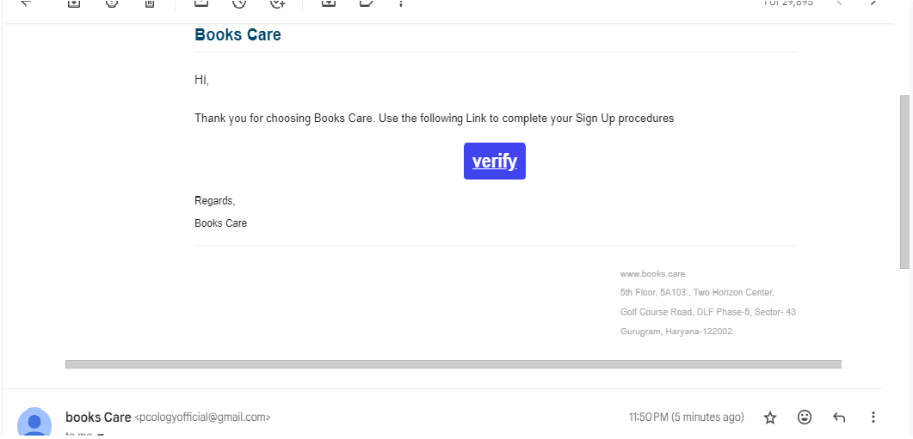
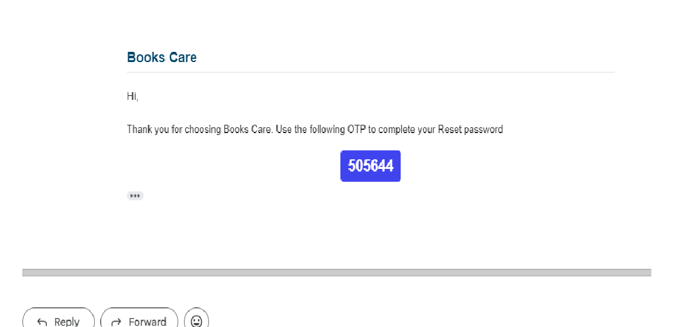

# Login and Registration System
#### Nodejs, ExpressJs,express-validator, nodemailer, mongoDb ...
Login and Registration System with Full Validation, Tokens, Super Admin, OTP-Based Forgot Password, Notifications, Books CRUD, User Requests, Roles & Permissions, and User Activity Log.
 
  
## Table of Contents

- [Introduction](#introduction)
- [Features](#features)
- [Installation](#installation)
- [Usage](#usage)
- [Routes](#routes)
- [Dependencies](#dependencies)
- [Contributing](#contributing)
- [License](#license)

## Introduction

This project is a comprehensive implementation of a login and registration system with various features such as full validation, JWT tokens for secure authentication, Super Admin functionality, OTP-based forgot password, notifications, CRUD operations for books, user requests for book purchase, roles & permissions, and user activity logging.

## Features

- User Registration with Full Validation (Email, Password, Profile) verification Link sent to gmail
- Secure Login with JWT Tokens
- Super Admin Functionality (Login, Forgot Password, Update Profile)
- Super Admin Can Create Users, See All Users, Activate/Deactivate Users
- OTP-Based Forgot Password with Email Notification
- Books CRUD Operations
- Users Can Purchase Books with Requests Sent to Admin
- Roles & Permissions
- User Activity Log

## Installation

1. Clone the repository:

   ```bash
   git clone https://github.com/your-username/your-repo.git
Install dependencies:
```bash
 cd your-repo 
 npm install
```

2. Set up your database and environment variables.   
 ### .env
```
CONNECTION_URL="mongodb+srv://###"

PORT = 4000

JWT_SECRET="saurabh"

USER_EMAIL=your@gmail.com

USER_PASSWORD= mfalyqlhbn

BASEURL='http://localhost:4000/v1/'
```
4.  Run the application:

```bash
npm start
```

#### Usage
1.  Register a new user with valid credentials.
2.  Log in using the registered credentials or as a Super Admin.
3.  Explore various features such as updating profiles, viewing all users, activating/deactivating users, and more.
## Routes

-   **User/Admin Routes:**
   #### All fields are mandatory
    -   `/register`: User registration route.
    -    `/"/verify/:userId/:uniqueString"`:verification Link after click.
    -   `/login`: User login route.
  #### BaseURL  http://localhost:4000/v1/users
 /register 
 post
 use real gmail because verification Link sent to your gmail
``` 
{
 "name":"saurabh",
"role":"user"/ "Admin",
"email":"saurabh.singh@gmail.com",
"password":"12345"
 }
```
/login
post
```
{
"email":"ssgkp.singh@gmail.com",
"password":"12345"
}
```
/forgotPassword
post
```
{
"email":"ssgkp.singh@gmail.com",
}
```
/resetPassword   (otp send to gmail)
post
```
{
"email":"ssgkp.singh@gmail.com",
}
```
/resetPassword
post
```
{
"email":"sddf@gmail.com", 
"otp":"342344",
"password":"1233wqe"
}
```
/purchaseRequest
```
{
"bookId":"1563523625665266",
}
```
/updateProfile
email cannot change
```
{
"email":"ssgkp.singh@gmail.com",
"name":"qwert"
 "age":24
}
```


for any help, you can DM me on LinkedIn
## 🔗 Links

[](https://www.linkedin.com/in/saurabh-singh-841590192)